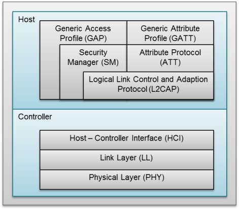

# 开篇和实验环境搭建

## 前提知识

这个系列面向想深入了解 BLE 底层实现的嵌入式开发者，阅读本文需要具备以下基础：

- **C 语言**：能够读懂操作寄存器的代码，理解指针、结构体、位域
- **嵌入式基础**：知道什么是中断、定时器、DMA，理解"往寄存器写值"的含义
- **BLE 使用经验**：理解广播、连接的基本概念
- **Zephyr RTOS 基础**：能够编译和烧录 Zephyr 工程（本系列使用 Zephyr 的 HAL 层）

不需要了解 BLE 协议规范的细节，这个系列会在用到每个概念时从头解释。

## 一、我们要实现BLE协议栈的哪些部分？


在蓝牙的协议架构中，整套协议被划分为两大部分。

* Host（主机层） 负责逻辑、安全和属性管理。它离应用层最近，负责"决策"比如"我想发一条消息"或"我要连接这个设备"，对应的是 GATT、GAP、L2CAP 等协议层。
* Controller（控制器层） 负责物理层（PHY）和链路层（LL）。它离硬件最近，负责"执行"在精确的时间点切换频率，把数据喷射到空气中，并确保每一帧的时序符合规范。Controller 完全感知不到"消息内容"是什么，它只知道比特流、频率、时序。

这个系列专注于 **Controller 层的实现**。Host 的逻辑我们会借用 Zephyr 的 Host 实现，而 Controller 从寄存器参数开始手写。

Host 和 Controller 之间通过 HCI（Host Controller Interface） 通信，这是蓝牙规范定义的标准接口。具体来说，HCI 是一套命令/事件/数据包规范：Host 向 Controller 发 HCI 命令（比如"开始扫描"），Controller 用 HCI 事件回复（比如"扫到了设备 XX"）。到系列后期，我们把自己写的 Controller 通过 HCI UART 连接到 Zephyr 的 Host 层，让整个蓝牙协议栈跑起来。

最终目标是：**从零实现一个完整的 BLE Controller，能和 Zephyr 的 Host 层配合，实现广播、连接、数据交互等功能**。

## 二、BLE 5.0 PHY 和 LL 知识点清单

以下两张表按照 **Bluetooth Core Specification v5.0** 的卷/篇/节结构排列，方便与规范原文对照查阅。

### 表一：PHY 层知识点（Vol 6, Part A + Part B 物理层相关）

| # | 知识点 | 规范出处 | 本系列已覆盖 |
|---|--------|----------|:----------:|
| | **Vol 6, Part A §1 — 概述** | | |
| 1 | 2.4 GHz ISM 频段（2400–2483.5 MHz） | Part A, §1 | ☑ (1-2) |
| | **Vol 6, Part A §2 — 频段与信道划分** | | |
| 2 | 40 信道划分（2 MHz 间距）：37 数据 + 3 广播 | Part A, §2 | ☑ (1-2, 4-3) |
| 3 | 广播信道选择（37/38/39 避开 Wi-Fi） | Part A, §2 | ☑ (1-2) |
| | **Vol 6, Part A §3 — 发射机特性** | | |
| 4 | GFSK 调制（BT=0.5, h=0.5）与调制特性 | Part A, §3.1 | ☑ (1-1 提及) |
| 5 | 频率容差（初始偏移 ±150 kHz，漂移 ±50 kHz） | Part A, §3.2 | ☐ |
| 6 | TX Power 配置与离散功率等级（–20 dBm ~ +10 dBm） | Part A, §3.3 | ☑ (1-1 提及) |
| 7 | 带内杂散发射（In-Band Spurious Emission） | Part A, §3.4 | ☐ |
| 8 | 带外杂散发射（Out-of-Band Spurious Emission） | Part A, §3.4 | ☐ |
| 9 | 稳定调制特性（Stable Modulation Index） | Part A, §3.5 (BLE 5.0) | ☐ |
| | **Vol 6, Part A §4 — 接收机特性** | | |
| 10 | 灵敏度（LE 1M: ≤ –70 dBm, LE 2M: ≤ –67 dBm, Coded S=8: ≤ –75 dBm） | Part A, §4.1 | ☐ |
| 11 | 最大输入信号电平（≥ –10 dBm） | Part A, §4.1 | ☐ |
| 12 | 干扰性能（C/I：同信道、邻信道、阻塞、互调） | Part A, §4.2 | ☐ |
| 13 | RSSI（接收信号强度指示，精度 ±6 dBm） | Part A, §4.3 | ☑ (1-2 提及) |
| 14 | TX/RX Ramp-Up（PLL 锁相预热 ~40 µs） | Part A, §4 注 | ☑ (1-1, 2-2) |
| | **Vol 6, Part B §2.1 — 非编码 PHY 的数据包格式** | | |
| 15 | **LE 1M PHY**（1 Mbps, 1-byte Preamble） | Part B, §2.1 | ☑ (1-2, 2-2) |
| 16 | **LE 2M PHY**（2 Mbps, 2-byte Preamble） | Part B, §2.1 | ☐ |
| 17 | 空中帧结构：Preamble → Access Address → PDU → CRC | Part B, §2.1 | ☑ (1-2) |
| 18 | Preamble（前同步码）：时钟恢复与比特同步 | Part B, §2.1.1 | ☑ (1-2) |
| 19 | Access Address：广播固定值 `0x8E89BED6`，连接私有 AA | Part B, §2.1.2 | ☑ (1-2, 3-1) |
| 20 | Access Address 生成规则（碰撞概率约束） | Part B, §2.1.2 | ☐ |
| | **Vol 6, Part B §2.2 — LE Coded PHY 数据包格式** | | |
| 21 | **LE Coded PHY**（S=2 / S=8, FEC + Pattern Mapper） | Part B, §2.2 | ☐ |
| | **Vol 6, Part B §3 — 比特流处理** | | |
| 22 | CRC-24 校验（多项式 $x^{24}+x^{10}+x^{9}+x^{6}+x^{4}+x^{3}+x+1$） | Part B, §3.1.1 | ☑ (1-2, 3-1) |
| 23 | 数据白化（Data Whitening, LFSR） | Part B, §3.2 | ☑ (2-2 提及) |
| 24 | LE Coded PHY 比特流处理（FEC 编码/解码、CI/TERM1/TERM2） | Part B, §3.3 | ☐ |
| | **Vol 6, Part B §4.1 — 帧间隔** | | |
| 25 | T_IFS（帧间间隔）= 150 µs ±2 µs | Part B, §4.1.1 | ☑ (2-2, 2-3) |
| 26 | T_IFS 的时间预算分解（射频切换 + 基带处理 + PLL 重锁定） | Part B, §4.1.1 | ☑ (2-2) |
| 27 | T_MAFS（最小辅助帧间隔）= 300 µs（BLE 5.0 扩展广播） | Part B, §4.1.2 (BLE 5.0) | ☐ |
| | **nRF52832 实现层** | | |
| 28 | RADIO 状态机（DISABLED↔TXRU↔TXIDLE↔TX / RXRU↔RXIDLE↔RX） | nRF52832 PS §6.20 | ☑ (1-1) |

---

### 表二：LL（链路层）知识点（Vol 6, Part B + Vol 3 + Vol 4）

| # | 知识点 | 规范出处 | 本系列已覆盖 |
|---|--------|----------|:----------:|
| | **§1 — 通用描述** | | |
| 1 | LL 概述与设备角色（Advertiser / Scanner / Initiator / Master / Slave） | Part B, §1.1 | ☑ (0-1, 2-1) |
| 2 | 比特序（LSB First on air） | Part B, §1.2 | ☐ |
| 3 | 设备地址类型：Public / Random Static / RPA / NRPA | Part B, §1.3 | ☑ (1-2 部分) |
| 4 | 物理信道（Advertising / Data / Periodic Physical Channel） | Part B, §1.4 | ☑ (1-2, 4-3 部分) |
| | **§2.3 — 广播信道 PDU** | | |
| 5 | 广播 PDU 类型：ADV_IND / ADV_DIRECT_IND / ADV_NONCONN_IND / ADV_SCAN_IND | Part B, §2.3.1 | ☑ (1-2, 2-1) |
| 6 | ADV_IND 广播帧格式（Header + AdvA + AdvData） | Part B, §2.3.1.1 | ☑ (1-2) |
| 7 | AD Structure 格式（Length-Type-Value） | CSS, Part A | ☑ (1-2) |
| 8 | SCAN_REQ 格式（ScanA + AdvA, 固定 12 字节） | Part B, §2.3.2.1 | ☑ (2-1) |
| 9 | SCAN_RSP 格式（ScanRspData, 最多 31 字节） | Part B, §2.3.2.2 | ☑ (2-1) |
| 10 | CONNECT_IND 格式与参数：InitA, AdvA, LLData | Part B, §2.3.3.1 | ☑ (3-1) |
| 11 | 身份类字段：AA（私有接入地址）、CRCInit | Part B, §2.3.3.1 | ☑ (3-1) |
| 12 | 时间类字段：WinSize, WinOffset, Interval, Latency, Timeout | Part B, §2.3.3.1 | ☑ (3-1) |
| 13 | 频率类字段：ChM, Hop, SCA | Part B, §2.3.3.1 | ☑ (3-1) |
| 14 | **扩展广播 PDU**（ADV_EXT_IND, AUX_ADV_IND, AUX_SYNC_IND 等） | Part B, §2.3.4 (BLE 5.0) | ☐ |
| 15 | **Common Extended Advertising Payload Format**（AdvMode, Header fields） | Part B, §2.3.4.1 (BLE 5.0) | ☐ |
| | **§2.4 — 数据信道 PDU** | | |
| 16 | 数据信道 PDU Header：LLID, NESN, SN, MD, Length | Part B, §2.4 | ☑ (6-1) |
| 17 | LL Data PDU 格式（LLID=01 Continuation / LLID=10 Start） | Part B, §2.4.1 | ☑ (6-1, 6-2) |
| 18 | LL Control PDU 格式与 Opcode 枚举（LLID=11） | Part B, §2.4.2 | ☑ (6-1 部分) |
| 19 | Empty PDU（空包 ACK, LLID=01, Len=0） | Part B, §2.4.2.4 | ☑ (6-1) |
| | **§4.2 — 链路层状态机** | | |
| 20 | LL 状态机总览（Standby / Advertising / Scanning / Initiating / Connection / Synchronization） | Part B, §4.2 | ☑ (1-2, 2-1, 4-1 隐含) |
| 21 | 状态机合法转移路径与多状态组合（BLE 4.1+） | Part B, §4.2 | ☐ |
| | **§4.3 — 设备过滤** | | |
| 22 | 白名单（White List / Filter Accept List） | Part B, §4.3.1 | ☐ |
| 23 | 广播/扫描/发起过滤策略（Filter Policy） | Part B, §4.3.2 | ☐ |
| | **§4.4 — 广播态与扫描态** | | |
| 24 | 广播间隔（advInterval, 20 ms – 10.24 s） | Part B, §4.4.2 | ☑ (1-2) |
| 25 | 广播信道轮询（37→38→39 逐信道发送） | Part B, §4.4.2 | ☑ (1-2) |
| 26 | 广播随机延迟（advDelay, 0–10 ms） | Part B, §4.4.2 | ☐ |
| 27 | **多广播集（Multiple Advertising Sets）** | Part B, §4.4.2 (BLE 5.0) | ☐ |
| 28 | 被动扫描（Passive Scanning） | Part B, §4.4.3.1 | ☑ (2-1) |
| 29 | 主动扫描（Active Scanning）：三包握手 ADV_IND→SCAN_REQ→SCAN_RSP | Part B, §4.4.3.2 | ☑ (2-1) |
| 30 | 扫描参数（scanInterval, scanWindow） | Part B, §4.4.3 | ☐ |
| 31 | 发起态（Initiating State）：监听 ADV_IND 后发送 CONNECT_IND | Part B, §4.4.4 | ☑ (3-1 隐含) |
| 32 | **扩展广播态（Extended Advertising State）**：Primary + Secondary ADV | Part B, §4.4.2 (BLE 5.0) | ☐ |
| 33 | **周期性广播（Periodic Advertising）** | Part B, §4.4.5 (BLE 5.0) | ☐ |
| | **§4.5 — 连接态** | | |
| 34 | Transmit Window（首次连接事件的接收窗口） | Part B, §4.5 | ☑ (4-1) |
| 35 | 连接事件（Connection Event）定义：Master 先发、Slave 后回 | Part B, §4.5.1 | ☑ (4-1) |
| 36 | 锚点（Anchor Point）定义与捕获（硬件 PPI 时间戳） | Part B, §4.5.1 | ☑ (4-1, 4-2) |
| 37 | connEventCounter（16-bit 回绕计数器） | Part B, §4.5.1 | ☑ (4-2, 8-1) |
| 38 | connInterval（连接间隔, 7.5 ms – 4 s） | Part B, §4.5.1 | ☑ (3-1, 4-1) |
| 39 | Supervision Timeout（超时断连, 100 ms – 32 s） | Part B, §4.5.2 | ☑ (3-1) |
| 40 | Slave Latency（跳过连接事件的低功耗策略） | Part B, §4.5.2 | ☑ (7-1) |
| 41 | 关闭连接事件的规则（Closing a Connection Event） | Part B, §4.5.3 | ☑ 10-1 |
| 42 | Transmit Window Narrowing（窗口收窄） | Part B, §4.5.4 | ☐ |
| 43 | Window Widening（窗口拓宽, 晶振漂移补偿） | Part B, §4.5.7 | ☑ (5-1) |
| 44 | SCA（Sleep Clock Accuracy）等级与 ppm 换算 | Part B, §4.5.7 | ☑ (5-1) |
| 45 | Channel Map（信道图）：5 字节 / 40-bit 标记可用信道 | Part B, §4.5.8 | ☑ (4-3) |
| 46 | **CSA#1 跳频算法**（Hop increment, UnmappedCh mod 37, Remapping） | Part B, §4.5.8.1 | ☑ (4-3) |
| 47 | **CSA#2 跳频算法**（基于 AES 的伪随机序列） | Part B, §4.5.8.2 (BLE 5.0) | ☐ |
| 48 | SN/NESN：1-bit Stop-and-Wait ARQ 可靠传输 | Part B, §4.5.9 | ☑ (6-1) |
| 49 | MD（More Data）位：同一连接事件内多包传输 | Part B, §4.5.9.3 | ☑ (6-1) |
| 50 | **Data Length Extension (DLE)**：单包最大 251 字节 | Part B, §4.5.10 (BLE 4.2) | ☑ (6-2 提及) |
| | **§4.6 — 同步态（BLE 5.0）** | | |
| 51 | **同步态（Synchronization State）**：周期性广播接收方的同步建立与维持 | Part B, §4.6 (BLE 5.0) | ☐ |
| | **§5 — LL Control Procedures** | | |
| 52 | Instant 机制（16-bit connEventCounter 对齐生效） | Part B, §5.1.1 | ☑ (8-1) |
| 53 | LL_CONNECTION_UPDATE_IND（连接参数在线更新） | Part B, §5.1.1 | ☑ (8-1) |
| 54 | LL_CHANNEL_MAP_IND（信道图在线更新） | Part B, §5.1.2 | ☑ (8-1) |
| 55 | LL_ENC_REQ / LL_ENC_RSP / LL_START_ENC（链路加密启动 AES-CCM） | Part B, §5.1.3 | ☑ (13-1) |
| 56 | LL_PAUSE_ENC_REQ / LL_PAUSE_ENC_RSP（暂停加密） | Part B, §5.1.3 | ☐ |
| 57 | LL_FEATURE_REQ / LL_FEATURE_RSP（特性协商） | Part B, §5.1.4 | ☑ (6-1 提及) |
| 58 | LL_SLAVE_FEATURE_REQ（Slave 发起的特性协商，BLE 4.1+） | Part B, §5.1.4 | ☐ |
| 59 | LL_REJECT_IND / LL_REJECT_EXT_IND（过程拒绝） | Part B, §5.1.5 | ☑ (11-1) |
| 60 | LL_TERMINATE_IND（链路层断连） | Part B, §5.1.6 | ☑ (11-1) |
| 61 | LL_CONNECTION_PARAM_REQ / RSP（Slave 发起参数更新） | Part B, §5.1.7.1 (BLE 4.1) | ☑ (11-1) |
| 62 | LL_PING_REQ / LL_PING_RSP（认证超时监控） | Part B, §5.1.7.2 (BLE 4.1) | ☐ |
| 63 | LL_VERSION_IND（版本交换） | Part B, §5.1.8 | ☑ (6-1 提及) |
| 64 | LL_LENGTH_REQ / LL_LENGTH_RSP（数据长度协商, DLE） | Part B, §5.1.9 (BLE 4.2) | ☑ (6-1 提及) |
| 65 | LL_PHY_REQ / LL_PHY_RSP / LL_PHY_UPDATE_IND（PHY 切换） | Part B, §5.1.10 (BLE 5.0) | ☐ |
| 66 | LL_MIN_USED_CHANNELS_IND（最少信道数指示） | Part B, §5.1.11 (BLE 5.0) | ☐ |
| | **Vol 6, Part B §6 — 链路层安全** | | |
| 67 | 加密引擎（AES-128 CCM）与 MIC 生成/校验 | Part B, §6 | ☑ (13-1) |
| 68 | 会话密钥分发（SKD / IV / LTK） | Part B, §6 | ☑ (13-1) |
| | **Vol 6, Part B §7 — LL 隐私（Privacy）** | | |
| 69 | 可解析私有地址（RPA）生成与解析 | Part B, §7 (BLE 4.2) | ☐ |
| 70 | 地址解析列表（Resolving List）与 Controller 端隐私 | Part B, §7 (BLE 4.2) | ☐ |
| | **Vol 3, Part A — L2CAP** | | |
| 71 | L2CAP CID 多路复用（ATT=0x0004, SMP=0x0006, Signaling=0x0005） | Vol 3, Part A, §2.1 | ☑ (6-2) |
| 72 | L2CAP Basic Frame 分片与重组（LLID Start/Continue） | Vol 3, Part A, §3 | ☑ (6-2) |
| 73 | L2CAP Signaling Channel（参数更新请求等） | Vol 3, Part A, §4 | ☑ (12-1) |
| 74 | LE Credit Based Flow Control（基于信用的流控，BLE 4.2+） | Vol 3, Part A, §10.2 (BLE 4.2) | ☐ |
| | **Vol 4, Part A — HCI 传输层** | | |
| 75 | HCI 分层：Command / Event / ACL Data | Vol 4, Part A | ☑ (9-1) |
| 76 | H4 传输协议（UART Packet Indicator） | Vol 4, Part A, §2 | ☑ (9-1) |
| 77 | H5（Three-Wire）传输协议（可靠重传 + 链路管理） | Vol 4, Part D | ☐ |
| 78 | HCI USB 传输 | Vol 4, Part B | ☐ |
| | **Vol 4, Part E — HCI 功能规范** | | |
| 79 | HCI Command 格式（OpCode = OGF\|OCF, Param Length） | Vol 4, Part E, §5 | ☑ (9-1) |
| 80 | HCI ACL Data 格式（Handle, PB Flag, BC Flag） | Vol 4, Part E, §5.4.2 | ☑ (9-2) |
| 81 | HCI Event 格式（Command Complete, Command Status） | Vol 4, Part E, §7.7 | ☑ (9-1) |
| 82 | LE Meta Event（广播报告、连接完成等） | Vol 4, Part E, §7.7.65 | ☑ (9-3 部分) |
| 83 | HCI ACL ↔ LL Data PDU 桥接（PB Flag ↔ LLID 映射） | 实现层 | ☑ (9-2) |
| 84 | HCI 初始化序列（Reset → Read Version → LE Read Buffer Size → …） | Vol 4, Part E | ☑ (9-3) |
| 85 | HCI LE 命令集（Set Advertising / Scan / Create Connection 等） | Vol 4, Part E, §7.8 | ☑ (9-3 部分) |
| | **Vol 3, Part H — SMP（安全管理协议）** | | |
| 86 | SMP 运行在 L2CAP CID=0x0006 上，Pairing Feature Exchange | Part H, §3.3 | ☑ (14-1) |
| 87 | LE Legacy Pairing：Confirm / Random 交换（TK=0，Just Works） | Part H, §2.3.5.5 | ☑ (14-1) |
| 88 | c1 / s1 密码学函数（基于 AES-128 的 confirm / STK 生成） | Part H, §2.2 | ☑ (14-1) |
| 89 | 密钥分发阶段：Encryption Information + Master Identification（LTK/EDIV/Rand） | Part H, §3.6 | ☑ (14-1) |
| 90 | LE Secure Connections Pairing（基于 ECDH，BLE 4.2+） | Part H, §2.3.5.6 | ☐ |
| | **Vol 3, Part F — ATT（属性协议）** | | |
| 91 | ATT 运行在 L2CAP CID=0x0004，客户端-服务端请求-应答模型 | Part F, §3 | ☑ (15-1) |
| 92 | Attribute：Handle / Type UUID / Permission / Value 四要素 | Part F, §3.1 | ☑ (15-1) |
| 93 | Exchange MTU Request/Response（默认 MTU=23） | Part F, §3.4.2 | ☑ (15-1) |
| 94 | Find Information Request/Response（Descriptor 发现） | Part F, §3.4.3 | ☑ (15-1) |
| 95 | Read By Type Request/Response（Characteristic 发现，uuid=0x2803） | Part F, §3.4.4 | ☑ (15-1) |
| 96 | Read By Group Type Request/Response（Service 发现，uuid=0x2800） | Part F, §3.4.10 | ☑ (15-1) |
| 97 | Read Request/Response | Part F, §3.4.4 | ☑ (15-1) |
| 98 | Write Request/Response：四级检查（Handle/权限/缓冲区/长度） | Part F, §3.4.5 | ☑ (16-1) |
| 99 | Handle Value Notification（opcode=0x1B，无需 Client 确认） | Part F, §3.4.7 | ☑ (16-1) |
| 100 | Handle Value Indication / Confirmation（需要 Client 确认） | Part F, §3.4.7 | ☐ |
| 101 | Error Response（opcode=0x01，含原始 opcode + handle + error code） | Part F, §3.4.1 | ☑ (15-1) |
| | **Vol 3, Part G — GATT（通用属性规范）** | | |
| 102 | GATT 层级：Service → Characteristic → Descriptor | Part G, §3 | ☑ (16-1) |
| 103 | Primary Service Declaration（uuid=0x2800）与 Service handle range | Part G, §3.1 | ☑ (16-1) |
| 104 | Characteristic Declaration（uuid=0x2803）：Properties / Value Handle / UUID | Part G, §3.3.1 | ☑ (16-1) |
| 105 | CCC Descriptor（uuid=0x2902）：Notification/Indication 开关 | Part G, §3.3.3.3 | ☑ (16-1) |
| 106 | Characteristic Properties 位图（Read=0x02, Write=0x08, Notify=0x10） | Part G, §3.3.1.1 | ☑ (16-1) |
| 107 | GATT Server 必备服务：GAP (0x1800) + GATT (0x1801) | Part G, §7 | ☑ (15-1, 16-1) |
| 108 | Service Discovery 流程（Read By Group Type → Read By Type → Find Info） | Part G, §4.4 | ☑ (15-1, 16-1) |
| | **实现层 — 调度与系统** | | |
| 86 | 精确锚点触发：Compare Match + PPI 硬件路径 | 实现层 | ☑ (4-2) |
| 87 | 调度器冲突与优先级仲裁（固定优先级 / EDF） | 实现层 | ☑ (5-2) |
| 88 | WinOffset 前瞻规划（避免锚点冲突） | Part B, §4.5 | ☑ (5-2) |

---

## 三、实验环境搭建

要实现这个目标，我们给出两种实验环境搭建方案：

- **方案一：物理开发板**。使用 Nordic nRF52832 开发板，直接在裸机环境下编写 Controller 代码。优点是 nRF52832 的 PPI 机制能实现精确时序；缺点是调试较复杂，需要烧录和使用逻辑分析仪观察信号。

- **方案二：模拟器**。使用 BabbleSim BLE 模拟器，在 PC 上模拟 BLE 硬件行为。优点是调试方便，可以导出 pcapng 文件用 Wireshark 分析每一帧数据包；缺点是无法完全还原真实硬件的时序行为。

注：我们没有选择 ESP32 等高度封装的芯片，因为它们的射频控制权被封装在闭源库里，无法满足我们对底层控制的需求。而 SDR（软件定义无线电）虽然灵活，但成本高且处理时延无法满足 BLE 的实时性要求。

---

### 工具链架构全局视图

在动手之前，先建立一个全局视图。不管选哪种方案，有三件工具是共同的：

| 工具 | 作用 |
|------|------|
| **west** | Zephyr 的工作区管理工具，类似 git submodule 的增强版。整个 Zephyr 工程由数十个 Git 仓库组成——Zephyr 内核、Nordic HAL、BabbleSim HW 模型……west 负责把它们全部拉下来、版本对齐、放到正确的目录 |
| **Zephyr SDK** | 包含所有目标架构的交叉编译工具链（ARM、RISC-V 等）。nRF52832 是 ARM Cortex-M4，需要其中的 `arm-zephyr-eabi-gcc` |
| **CMake + Ninja** | Zephyr 使用 CMake 生成构建规则，Ninja 执行并行编译 |

两种方案的差异在于「最后一公里」：方案一需要把 `.hex` 文件烧进芯片（nrfjprog + J-Link）；方案二需要 Linux 仿真环境（WSL）和信道仿真器（BabbleSim PHY）。

---

### 方案一：物理开发板（nRF52832）

硬件清单：

- 芯片：<a href="https://uland.taobao.com/coupon/edetail?e=lk0%2FVMKCRf2lhHvvyUNXZfh8CuWt5YH5OVuOuRD5gLJMmdsrkidbOWBzzpT26idJU%2FZA32KvGrQCsH4Kgaxm9H9Li%2FdOOkLACrEhxhp%2BQg5RtyHXCHjC%2Fk0gk4pBAlJ%2B0peqjG3rs24R9msLEk0PStVqM6BWlz38qRlCLsmR9KBD1ALJmUcoX446JfYFzU112sZqsOPafS%2FJanlAprS3R0eFtAaX3AHoGPeuh9JGkqbC5eFlzO9mNOaXiqMNuSIa35LuBgdSnGsOX5jhGlYUyZ9dfaH23cVk8ZLhenDe0Gr4DwFkg2ahQv9mMzi7CEAGc3rE49TEBcqNafwdA33KGFDik9XfzNxNZQUWDPdEFUc%3D&traceId=213e029817751856526698076e0d61&union_lens=lensId%3APUB%401775185469%40213dc32c_0e0c_19d514ca159_dcba%40035NYCj1gLC0wZxGzZpuIm31%40eyJmbG9vcklkIjo4NTQ2Nywiic3BtQiiI6Il9wb3J0YWxfdjJfcGFnZXNfcHJvbW9fZ29vZHNfZGV0YWlsX2h0bSIsInNyY0Zsb29ySWQiiOiiI4MDY3NCJ9%3BtkScm%3AselectionPlaza_site_4358_0_0_0_4_177518546984410102818644%3Bscm%3A1007.30148.329090.pub_search-item_b764fb54-c7b6-4785-9698-f11a64f5429e_" style="color: blue; text-decoration: underline;"> nRF 52832 开发板 </a>
- 协议分析：<a href="https://s.click.taobao.com/t?e=m%3D2%26s%3Dr7tEGGpMwTZw4vFB6t2Z2ueEDrYVVa64g3vZOarmkFi53hKxp7mNFl906SyIHsHUThe%2Bu22kUAD0JlhLk0Jl4ffnqEScwp4CHeH0x2mWMkfVRy4wTR8XDHqLIb1CWodRoP%2FMpo7T%2FHfWqunGLAygI3FzUC1tkZVLL9JIcacE30EDsVizUeQ%2FZ80Q9fK1X0Au0ItOGVs%2B65ktv3cN%2Fx87OD7ys1eNjhW6Hp%2ByzJMet6WBYPCmZr1UiT%2B69HOBL1kT5s219pqTcrdH71RU5tkt6YwmLWBgEm80VKxcI130SjE5TU4nam2h3UkqvUMTrfghQ1UI2h%2BpPJuiZ%2BQMlGz6FQ%3D%3D&union_lens=lensId%3APUB%401775184265%40212be787_0d71_19d513a4146_2848%40025VYm6THLrOACU6eIB9v9zL%40eyJmbG9vcklkIjo4MDY3NCwiic3BtQiiI6Il9wb3J0YWxfdjJfcGFnZXNfcHJvbW9fZ29vZHNfaW5kZXhfaHRtIiiwiic3JjRmxvb3JJZCI6IjgwNjc0In0ie%3BtkScm%3AselectionPlaza_site_4358_0_0_0_2_177518426562410102818644%3Bscm%3A1007.30148.329090.pub_search-item_2e8ed3d4-b868-466b-9370-a2153a814cef_" style="color: blue; text-decoration: underline;"> nRF 52840 BLE Dongle 蓝牙嗅探器 </a>（可选，用于嗅探空口数据包）
- 时序分析：<a href="https://s.click.taobao.com/t?e=m%3D2%26s%3DiTyg5hKy2t1w4vFB6t2Z2ueEDrYVVa64g3vZOarmkFi53hKxp7mNFl906SyIHsHUjFagsxxBlU30JlhLk0Jl4ffnqEScwp4CHeH0x2mWMkfVRy4wTR8XDHqLIb1CWodRoP%2FMpo7T%2FHfWqunGLAygI3FzUC1tkZVLAdOdwra7eDMmt%2BbG1%2FN%2F%2Fowe6%2FtGg2%2FRDSMWxuxDspYvZYqOe8c7%2Fn0jTTF9o3UDvjOLIL8ZhZtzhUtjCMVT2ysvF15AT3sJGtgciK%2B28sY5rKAmhW94T5GZ9wPRcXV%2BBfuqljaE3xpNzuMLUNyvdEJo9rViF8f%2BMWn%2FKrx1bT6MosMYYBet5g%3D%3D&union_lens=lensId%3APUB%401775184637%40212b04fa_0ddd_19d513fec4d_bd19%40023feHN7AZELJU7CHL9ZEv9M%40eyJmbG9vcklkIjo4MDY3NCwiic3BtQiiI6Il9wb3J0YWxfdjJfcGFnZXNfcHJvbW9fZ29vZHNfaW5kZXhfaHRtIiiwiic3JjRmxvb3JJZCI6IjgwNjc0In0ie%3BtkScm%3AselectionPlaza_site_4358_0_0_0_3_177518463707710102818644%3Bscm%3A1007.30148.329090.pub_search-item_6f57af67-3530-46fb-a4da-25972ae0f2a3_" style="color: blue; text-decoration: underline;"> 逻辑分析仪 </a>（可选，用于观察引脚时序波形）
- 协议分析：<a href="https://s.click.taobao.com/t?e=m%3D2%26s%3D7BNzCEXiFj9w4vFB6t2Z2ueEDrYVVa64g3vZOarmkFi53hKxp7mNFl906SyIHsHUOGRhL4%2FIFYP0JlhLk0Jl4ffnqEScwp4CHeH0x2mWMkfVRy4wTR8XDHqLIb1CWodRoP%2FMpo7T%2FHfWqunGLAygI3FzUC1tkZVLER1GO%2FyqxPOUNXX8VrDx%2FIwe6%2FtGg2%2FRjN4f8DSxNxvKUMRmCodKxfjP8DFFeNP%2FAdnlyiMv30oW3F8r%2BWuhb6Oqo8VZaRPJJksQciOt8MSELivGZA6J8kLEkqTedE399KEV1g6mN9AvJ%2BRImokg1xYExnGfJnE1xgxdTc00KD8%3D&union_lens=lensId%3APUB%401775184749%40212b047e_0d8a_19d5141a3a6_7c7e%4003Z0B4g7YzVSE6vpFkttXaq%40eyJmbG9vcklkIjo4NTQ2Nywiic3BtQiiI6Il9wb3J0YWxfdjJfcGFnZXNfcHJvbW9fZ29vZHNfZGV0YWlsX2h0bSIsInNyY0Zsb29ySWQiiOiiI4MDY3NCJ9%3BtkScm%3AselectionPlaza_site_4358_0_0_0_1_177518474951110102818644%3Bscm%3A1007.30148.329090.pub_search-item_ffdfa66b-c263-43ae-90d3-5e79418f1775_" style="color: blue; text-decoration: underline;"> BPA low energy 蓝牙分析仪 </a>（可选，比 Dongle 更专业）

#### 第一步：安装 west 和 Python 依赖

west 是 Zephyr 生态的「总管家」，没有它，你不知道要下载哪些仓库、下载到哪里、版本应该对齐到哪个提交。west 本身是一个 Python 包，需要先创建专用的虚拟环境再安装：

```powershell
# 新建工作区目录，在其中隔离 Python 依赖
mkdir D:\zephyrproject
cd D:\zephyrproject
python -m venv .venv
.venv\Scripts\Activate.ps1

pip install west
west --version  # 验证安装成功
```

#### 第二步：初始化 Zephyr 工作区

west 的初始化做两件事：先把一份「manifest 清单文件」（west.yml）拉下来，然后根据这份清单把所有依赖仓库 clone 到正确的位置。

> **为什么不直接 git clone Zephyr？** Zephyr 工程本身依赖数十个 HAL 库（Nordic nrfx、ARM CMSIS、mbedTLS……），这些库不在 Zephyr 主仓库里，必须靠 west 一起拉取。单独 clone Zephyr 主仓库的话，头文件和驱动库都缺失，根本无法编译。

```powershell
# west init 仅下载 manifest，west update 才拉取所有依赖仓库（约 3-5 GB）
west init -m https://github.com/zephyrproject-rtos/zephyr --mr v4.3.0 D:\zephyrproject
cd D:\zephyrproject
west update
```

遇到网络超时可反复执行 `west update`，它会跳过已下载完成的仓库继续拉取。

下载完毕后，安装 Zephyr 需要的 Python 包：

```powershell
pip install -r D:\zephyrproject\zephyr\scripts\requirements.txt
```

#### 第三步：安装 Zephyr SDK（ARM 交叉编译工具链）

nRF52832 是 ARM Cortex-M4 内核，运行的是 ARM 机器码，而你的开发机是 x86/amd64。两者的指令集完全不同——你的系统编译器只能生成本机（x86）代码，无法直接生成 ARM 代码。我们需要的是**交叉编译器（Cross Compiler）**：它运行在 x86 PC 上，但输出的是 ARM 机器码。Zephyr SDK 已经打包好了这种工具链。

前往 Zephyr SDK 的 [GitHub Releases 页面](https://github.com/zephyrproject-rtos/sdk-ng/releases) 下载 Windows 最小安装包（文件名类似 `zephyr-sdk-0.x.x_windows-x86_64_minimal.7z`），解压后执行安装脚本，仅安装 ARM 部分：

```powershell
cd D:\zephyr-sdk-0.x.x
.\setup.cmd -t arm-zephyr-eabi
```

然后让 west 记住工具链的位置：

```powershell
west sdk install -t arm-zephyr-eabi
```

#### 第四步：安装 nRF Command Line Tools（烧录工具）

编译产生的 `.hex` 文件需要通过 J-Link 调试器写入芯片 Flash。nRF52832 开发板上内置了一颗 J-Link OB（On-Board）调试芯片——USB 插入 PC 后，J-Link 驱动会建立一条调试通道，命令行工具 `nrfjprog` 通过这条通道执行擦除、烧录等操作。

前往 [Nordic 官网下载页面](https://www.nordicsemi.com/Products/Development-tools/nRF-Command-Line-Tools) 下载并安装 nRF Command Line Tools（包含 nrfjprog 和 J-Link 驱动）。

验证安装：

```powershell
nrfjprog --version
```

#### 第五步：配置 VS Code

安装以下 VS Code 扩展：

| 扩展名 | 作用 |
|--------|------|
| **C/C++**（`ms-vscode.cpptools`） | C 代码智能提示、跳转定义、语法高亮 |
| **CMake Tools**（`ms-vscode.cmake-tools`） | 识别 CMakeLists.txt，提供图形化编译入口 |
| **nRF Connect for VS Code**（`nordic-semiconductor.nrf-connect`） | 集成 west 编译、烧录、调试，Nordic 官方扩展 |
| **Cortex-Debug**（`marus25.cortex-debug`） | 通过 J-Link 在 Zephyr RTOS 任务级别打断点、查看寄存器 |

#### 第六步：编译并烧录首个例程

插入 nRF52832 开发板，编译 `01_tx_advertise` 例程：

```powershell
west build -b nrf52dk/nrf52832 write-BLE-stack-from-scratch/01_tx_advertise/ -p
```

`-p` 表示 pristine build（全量重建），第一次编译或切换例程时必须加，否则 CMake 缓存会导致文件缺失或版本混乱。

编译成功后，烧录：

```powershell
west flash
```

烧录完成后，用手机安装 nRF Connect App（Nordic 官方），扫描后会看到名为 `ZephyrRaw` 的广播设备，说明例程正在运行。

---

### 方案二：BabbleSim 模拟器（WSL）

BabbleSim 是 Nordic Semiconductor 开发的开源 2.4 GHz 无线仿真框架，已集成进 Zephyr 的官方测试基础设施。它的核心思路是：把每个「设备」编译成一个 Linux 进程，各设备进程通过一个专门的「PHY 进程」交换无线数据包，从而在软件层面模拟空口的发送、接收和信道效应。

```
┌──────────────────────────────────────────────────┐
│              BabbleSim 仿真架构                   │
│                                                  │
│  ┌─────────────┐     Unix Socket    ┌──────────┐ │
│  │  设备进程 0  │ ←────────────────→ │          │ │
│  │（我们的代码）│                   │  PHY 进程 │ │
│  └─────────────┘                   │（信道仿真）│ │
│  ┌─────────────┐                   │          │ │
│  │  设备进程 1  │ ←────────────────→ │          │ │
│  │（扫描方）    │                   └──────────┘ │
│  └─────────────┘                                │
└──────────────────────────────────────────────────┘
```

类比来说：PHY 进程就像一间「无线电暗室」的控制台，每个设备进程把「要发送的数据包 + 频率 + 功率」告诉控制台，控制台计算这个包能不能被其他设备收到（根据距离、衰落模型），然后决定要不要把包投递给哪些接收方。整个过程在软件层模拟了现实中的无线信道。

BabbleSim 只支持 Linux。在 Windows 上，我们通过 **WSL2（Windows Subsystem for Linux 2）** 来运行它。

#### 第一步：启用 WSL2 并安装 Ubuntu 24.04

WSL2 是 Windows 10/11 内置的一个完整 Linux 内核虚拟化方案，运行在 Hyper-V 轻量级虚拟机中，拥有完整的 Linux 系统调用，可以运行任意 Linux 程序。

以管理员身份打开 PowerShell：

```powershell
wsl --install -d Ubuntu-24.04
```

安装完成后重启，按提示设置 Linux 用户名和密码。之后验证 WSL 版本：

```powershell
wsl --status
```

确认输出中 `Default Version: 2`。如果显示 `1`，执行 `wsl --set-default-version 2` 升级。

后续所有 WSL 命令都以 root 用户执行：

```powershell
wsl -u root
```

> **为什么用 root 用户？** Zephyr 仓库存放在 Windows 的 NTFS 驱动器（`D:\`）上，挂载到 WSL 后路径是 `/mnt/d/`。NTFS 不支持 Linux 的文件权限模型（uid/gid），所有文件的「拥有者」都会被映射为当前 WSL 用户。非 root 用户运行时，Git 会认为跨用户边界的仓库「不安全」而拒绝 `git status/fetch` 等操作，导致 `west update` 失败。使用 root 可以绕过此限制；也可以执行 `git config --global --add safe.directory '*'` 来显式信任所有目录（同样有效，见第三步）。

#### 第二步：安装系统依赖

BabbleSim 的 PHY 模拟器是一个 **32 位** Linux 程序（为了与嵌入式目标的 ABI 对齐，整个 BabbleSim 工具链采用 32 位构建），而 Ubuntu 24.04 默认只安装了 64 位的 C 库和编译器头文件。要编译和运行 32 位程序，需要额外安装多架构支持包。

在 WSL Ubuntu 终端中执行：

```bash
apt-get update
apt-get install -y \
    cmake ninja-build \
    gcc g++ \
    gcc-multilib g++-multilib \
    python3-pip python3-venv \
    libc6-i386 lib32stdc++6 \
    libsdl2-dev git
```

各依赖包的作用：

| 包名 | 作用 |
|------|------|
| `cmake` + `ninja-build` | Zephyr 的构建系统 |
| `gcc` + `g++` | 编译 BabbleSim PHY（主机端 64 位部分） |
| `gcc-multilib` + `g++-multilib` | 提供 32 位编译头文件，给 `-m32` 标志使用 |
| `libc6-i386` + `lib32stdc++6` | 32 位 C/C++ 运行时，运行编译好的 BabbleSim 可执行文件所需 |
| `libsdl2-dev` | BabbleSim 图形扩展的依赖，不安装则带 GUI 的仿真组件会编译失败 |

> **如果跳过 `gcc-multilib` 会怎样？** 在之后编译 BabbleSim 时，会报 `fatal error: bits/libc-header-start.h: No such file or directory`，整个 `make` 过程中止，无法生成任何可执行文件。

#### 第三步：配置 Git 信任目录，创建 Python 虚拟环境

NTFS 挂载的仓库会触发 Git 的「dubious ownership」检查，导致 west 在执行 git 操作时中止。一条命令解决：

```bash
git config --global --add safe.directory '*'
```

创建并激活专用的 Python 虚拟环境（避免污染系统 Python，也方便在不同项目间切换版本）：

```bash
cd /mnt/d/software/zephyrproject
python3 -m venv .venv
source .venv/bin/activate
```

安装 west（国内网络建议用清华镜像，包内容与 PyPI 官方完全一致，只是加速下载）：

```bash
pip install west -i https://pypi.tuna.tsinghua.edu.cn/simple
```

安装 Zephyr 的 Python 依赖：

```bash
pip install -r /mnt/d/software/zephyrproject/zephyr/scripts/requirements.txt \
    -i https://pypi.tuna.tsinghua.edu.cn/simple
```

#### 第四步：启用 BabbleSim 组并下载仿真器源码

Zephyr 的 `west.yml` 清单文件用「组（group）」管理可选依赖。BabbleSim 相关仓库默认**关闭**（因为大多数用户不需要仿真），需要手动启用后再执行 `west update`：

```bash
cd /mnt/d/software/zephyrproject/zephyr
west config manifest.group-filter -- +babblesim
west update
```

`west update` 完成后，BabbleSim 的源码会出现在 `/mnt/d/software/zephyrproject/tools/bsim/components/` 目录下：

```
components/
├── ext_2G4_phy_v1/           ← 2.4 GHz PHY 核心仿真逻辑
├── ext_2G4_channel_NtNcable/ ← 信道模型：直连无损（适合功能验证）
├── ext_2G4_channel_multiatt/ ← 信道模型：多路径衰落（仿真真实空口质量）
├── ext_2G4_libPhyComv1/      ← 设备进程与 PHY 进程的通信库
└── ext_2G4_modem_BLE_simple/ ← BLE 解调模型（控制误码率特性）
```

#### 第五步：编译 BabbleSim PHY 模拟器

BabbleSim 使用自己的 Makefile（不是 CMake），编译入口在 `components/common/Makefile`。`BSIM_OUT_PATH` 参数指定编译产物（可执行文件和共享库）的输出目录：

```bash
cd /mnt/d/software/zephyrproject/tools/bsim
make -f components/common/Makefile everything \
    BSIM_OUT_PATH=/mnt/d/software/zephyrproject/tools/bsim \
    -j$(nproc)
```

编译成功后，`bin/` 目录下会出现下列文件：

```
bin/
├── bs_2G4_phy_v1           ← PHY 主程序：信道仿真核心
├── bs_device_empty         ← 空设备（占位用，凑 -D 参数的设备数）
├── bs_device_handbrake     ← 仿真减速器（用于慢放调试）
lib/
└── lib_2G4Channel_NtNcable.so   ← 直连信道模型（动态加载）
```

#### 第六步：将可执行文件部署到 Linux 原生文件系统

这一步解决一个关键的运行问题：BabbleSim 的可执行文件在 `/mnt/d/`（NTFS 挂载点）上**无法直接执行**。

原因有两个：

1. **权限位缺失**：NTFS 挂载点上的文件没有 Linux 执行权限位（x bit）。即使文件内容是合法的 ELF 二进制，内核也会因为 `EACCES`（Permission denied）拒绝运行它。`chmod +x` 在 NTFS 上不会真正生效。

2. **共享库相对路径失效**：`bs_2G4_phy_v1` 启动时用相对路径 `../lib/lib_2G4Channel_NtNcable.so` 加载信道模型。如果从 `/mnt/d/...bin/` 路径运行时发生任何路径解析问题，这条相对路径会指向错误位置，加载失败，PHY 进程直接崩溃退出。

解决方法是把 `bin/` 和 `lib/` 目录复制到 WSL 的原生 ext4 文件系统（`/root/bsim/`）：

```bash
mkdir -p ~/bsim
cp -r /mnt/d/software/zephyrproject/tools/bsim/bin ~/bsim/
cp -r /mnt/d/software/zephyrproject/tools/bsim/lib ~/bsim/
```

验证 PHY 能正常启动（必须 `cd` 进 `bin/` 目录再运行，保证 `../lib/` 相对路径可以解析到 `~/bsim/lib/`）：

```bash
cd ~/bsim/bin
./bs_2G4_phy_v1 --help
```

看到帮助输出即说明 BabbleSim 环境就绪。

#### 第七步：编译第一个例程（nrf52_bsim 目标）

为 BabbleSim 编译时，需要指定特殊的板子目标：`nrf52_bsim`。

`nrf52_bsim` 和真实的 `nrf52dk/nrf52832` 共享绝大部分代码——同样的 nRF52832 外设头文件、nrfx HAL 层、Zephyr 内核。核心区别是：`nrf52_bsim` 将所有硬件寄存器背后的实现替换为 BabbleSim 的硬件模型（`nrf_hw_models`）。换言之，当你的代码对 `NRF_CLOCK->TASKS_HFCLKSTART` 写 `1` 时，调用的不是真实的时钟电路，而是一个 C 函数 `nhw_CLOCK_regw_sideeffects_TASKS_HFCLKSTART()`，它会在仿真时间轴上安排一个「HFXO 启动完成」事件。

另一个重要差异：编译工具链不再是 ARM 交叉编译器，而是本机的 `gcc`（因为仿真程序最终在开发机的 Linux 上运行），通过 `ZEPHYR_TOOLCHAIN_VARIANT=host` 指定：

```bash
export ZEPHYR_TOOLCHAIN_VARIANT=host

west build \
    -b nrf52_bsim \
    /mnt/d/software/zephyrproject/zephyr/write-BLE-stack-from-scratch/01_tx_advertise/ \
    --build-dir /root/bsim_builds/01_tx_advertise \
    -p \
    -- \
    -DBSIM_OUT_PATH=/mnt/d/software/zephyrproject/tools/bsim \
    -DBSIM_COMPONENTS_PATH=/mnt/d/software/zephyrproject/tools/bsim/components
```

编译成功后，得到 `/root/bsim_builds/01_tx_advertise/zephyr/zephyr.exe`。注意：文件名后缀是 `.exe` 但它是一个标准的 Linux ELF 32 位可执行文件，与 Windows `.exe` 格式无关，这只是 Zephyr 对仿真目标的命名惯例。

把它复制到 `~/bsim/bin/`，并按 BabbleSim 命名规范 `bs_<板子>_<应用名>` 命名：

```bash
cp /root/bsim_builds/01_tx_advertise/zephyr/zephyr.exe \
   ~/bsim/bin/bs_nrf52bsim_01_tx_advertise
```

#### 第八步：运行仿真并观察输出

一次 BabbleSim 仿真需要同时启动两类进程，且顺序不能错：**先启动 PHY，再启动设备**。

PHY 进程的 `-D=1` 告诉它「等待 1 个设备进程接入」。PHY 只有在所有声明的设备都连接进来之后，才会开始推进仿真时钟。如果先启动设备但 PHY 还没有启动，设备进程会因为找不到 Unix Socket 而立即退出。

```bash
SIM_ID="sim_adv01"
cd ~/bsim/bin

# 先启动 PHY（后台运行），仿真长度 3,000,000 µs = 3 秒
./bs_2G4_phy_v1 -s=${SIM_ID} -D=1 -sim_length=3000000 &
PHY_PID=$!

# 再启动设备进程（前台，-d=0 表示设备编号 0）
./bs_nrf52bsim_01_tx_advertise -s=${SIM_ID} -d=0

# 等待 PHY 仿真结束
wait ${PHY_PID}
```

正常输出：

```
d_00: @00:00:00.001038  HFCLK (16MHz HFXO) started
d_00: @00:00:00.001038  Radio configured via HAL: BLE 1M, AA=0x8E89BED6, CRC_IV=0x555555
d_00: @00:00:00.001038  Starting advertising on channels 37/38/39...
d_00: @00:00:00.910233  Sent 10 advertising events
d_00: @00:00:01.919449  Sent 20 advertising events
d_00: @00:00:02.928665  Sent 30 advertising events
```

`d_00` 表示设备 0 的输出；`@00:00:02.928665` 是仿真时间（不是墙钟时间），精度到微秒级。可以看到每约 100 ms 发送一轮广播事件（3 个信道 37/38/39），3 秒共发送了 30 次。

#### 第九步：导出 pcapng 用 Wireshark 分析

每次仿真结束后，BabbleSim PHY 会把所有设备的空口活动记录到 CSV 文件，存放在 `~/bsim/results/<sim_id>/` 目录下：

```
d_2G4_00.Tx.csv     ← 设备 0 的所有发包记录（时间、频率、包体）
d_2G4_00.Rx.csv     ← 设备 0 的所有收包尝试记录（即使未收到也记录）
d_2G4_00.RSSI.csv   ← RSSI 测量记录
```

BabbleSim 提供了 Python 脚本 `csv2pcapng`，把 Tx/Rx CSV 文件转为标准 pcapng 格式（pcapng 是 Wireshark 的原生格式，包含完整的包元数据和时间戳）：

```bash
POSTPROC=/mnt/d/software/zephyrproject/tools/bsim/components/ext_2G4_phy_v1/dump_post_process

python3 ${POSTPROC}/csv2pcapng \
    -o /mnt/d/software/zephyrproject/zephyr/write-BLE-stack-from-scratch/tools/01_tx_advertise/01_tx_advertise.pcapng \
    ~/bsim/results/sim_adv01/d_2G4_00.Tx.csv
```

用 Wireshark 打开生成的 `.pcapng` 文件，显示过滤器输入 `btle`，可以看到每一帧 ADV_IND 包的完整解码：接入地址（`0x8E89BED6`，BLE 广播固定值）、PDU 头部字段、广播地址（`11:22:33:44:55:66`）、AD payload（设备名 `ZephyrRaw`、Flags、TX Power）。

---

为方便起见，项目提供了一键脚本，自动完成第七步到第九步（编译 → 仿真 → 导出 pcapng）：

```powershell
# 在 Windows PowerShell 中执行（脚本内部通过 WSL 运行）
wsl -u root -e bash 'D:\software\zephyrproject\zephyr\write-BLE-stack-from-scratch\tools\01_tx_advertise\bsim_run_01.sh'
```

无论选择哪种方案，后续文章中的代码和实验步骤两种环境都适用。每篇文章的「实验」小节会同时给出两套运行说明。