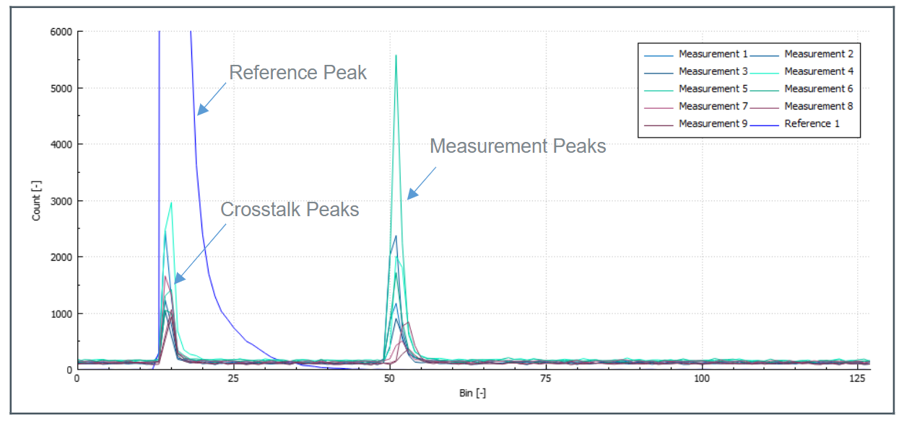
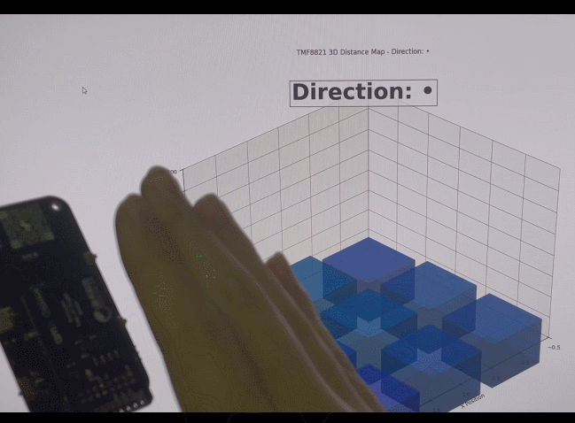

之前参加了硬禾和 AMS OSRAM 联合举办的活动。这里记录一下这款传感器的特性和实际应用的思路。

## dToF 传感器原理

dToF 传感器是一种距离传感器，可用于实现距离检测、手势检测，障碍识别等功能，在智能手机、AR/VR、汽车苹果 iPad Pro 的 LiDAR 技术也有 dToF 的身影。  
关于 TMF 882 x 系列传感器的原理，它的手册 上是这么描述的：  
TMF 8820/21/28 的基本原理是通过垂直腔面发射激光器（VCSEL） 发射一系列脉冲，脉冲的设置由迭代配置决定。这些脉冲通过微透镜阵列（MLA）射向照明场（Fol，field of illumination）范围。物体会将这些脉冲光反射到 TMF 8820/21/28 的接收镜片，进入单光子雪崩二极管（SPAD ，single photon avalance detector) 阵列。时间数字转换器 (TDC，time to digital converter）会测量这些脉冲光从发射到接收的时间，并将这些次数统计到一个直方图的每个时间区间内。TMF 8820/21 一次发送 550 k 个脉冲，TDC 的完整直方图如图 23 所示。

> The TMF 8820/21/28 operating principle uses a pulse train of VCSEL pulses defined by the iteration setting. These pulses are spread using a MLA (micro lens array) to illuminate the FoI (field of illumination). An object reflects these rays back to the TMF 8820/21/28 receiver optics lens and onto a SPAD (single photon avalanche detector) array. A TDC (time to digital converter) measures now the time from emission of these pulses to their arrival and accumulates the hits into bins inside a histogram. As TMF 8820/21 sends 550 k pulses (default settings), the output of the TDC is a full histogram as shown in Figure 23.  




可以看到图中有两个尖峰。  
左边的尖峰是由 VCSEL 腔体内部的 SPAD 生成的。也就是说，就算传感器上方什么都没有，也会产生这个尖峰。这个尖峰和 bin 15 附件的串扰被用来计算零距离。  
右边的尖峰出现在 bin 50 的位置。在传感器内部有一个 ARM M 0 的处理器，负责将这些表示时间的 bin 值转换成距离值。在图中的例子里面，bin 50 对应的实际距离为 2 m。因此，可以根据这个直方图判断出，距离 2 M 的地方有一个障碍物。

根据手册上的描述，在 10 m 范围内，TMF 882 x 的测量精度在 3%以内。我找到了一个 TI 的 TDC 7200, 它的分辨率是 55 ps。如果要达到 1 cm 的分辨率，TDC 的精度就要在 1∗10−2 m 3∗108 m/s=33∗10−12 s=33 ps。

## 数据预处理

我手上拿到的是 TMF 8821 传感器，它可以根据配置在 Fol 内测量 3×3，3×4，4×4 个区域。如果配置成 3×3，就会生成总共 9 个直方图。观察下面的直方图可以看到在除了在距离 2 m 的地方有一个物体，右上角的区域还在距离 50 cm 的地方检测到了一个物体。  


为了方便使用，传感器内部的处理器会对直方图进行进一步处理，最后通过传感器的 i 2 c 接口获取到的数据格式 [[2]] (https://www.cnblogs.com/ixbwer/p/19001142#fn2) 是这样的：

```none
#Obj,i2c_slave_address,result_number,temperature,number_valid_results,device_ticks,distance0_in_mm,confidence0,distance1_in_mm,confidence1,distance2_in_mm,confidence2, ...
```

其中最关键的数据是后面的 distancex_in_mm 和 confidencex。分别表示距离和置信度。置信度越高，对应测量出来的距离就越可靠。  
到这里为止，所有的数据处理都是传感器内部完成的。用户拿到了距离+置信度的护具之后，就可以根据需要实现对应的算法。

## 手势识别算法

在实现手势识别算法之前，我写了一个简单的脚本对前面接收到的距离和置信度数据进行处理，将其可视化并且将置信度较低的数据过滤掉之后，就得到了下面的效果：




图中的 9 个圆柱的高度表示传感器的 9 个区域检测到的距离。可以看到，虽然只提供了 9 个点的距离值，但是数据的更新速率和响应速度还是比较好的，可以轻松支持实现距离检测和手势识别的功能。

下面是我实现的手势检测的算法。原理是对于每一帧数据，根据各个点的高度计算质心，来推断“手”所在的位置。通过计算连续的数据中的质心的变化方向，来计算手移动的方向，代码如下：

```cpp
char determine_direction(std::deque<std::pair<std::vector<uint16_t>, std::vector<uint8_t>>> &buffer) {
    if (buffer.size() < 3) {
      return '-';
    }

    // Only consider objects within 100mm for direction detection
    const int max_distance_for_direction = 100;
    
    std::vector<std::pair<float, float>> centroids;
    for (const auto &frame : buffer) {
        const auto &distances = frame.first;
        std::vector<float> x_coords, y_coords;
        for (size_t i = 0; i < distances.size(); ++i) {
            // Only consider points within the maximum distance threshold
            if (distances[i] > 0 && distances[i] <= max_distance_for_direction) {
                x_coords.push_back(i % 3);
                y_coords.push_back(i / 3);
            }
        }
        if (!x_coords.empty() && !y_coords.empty()) {
            float g_x = std::accumulate(x_coords.begin(), x_coords.end(), 0.0f) / x_coords.size();
            float g_y = std::accumulate(y_coords.begin(), y_coords.end(), 0.0f) / y_coords.size();
            centroids.emplace_back(g_x, g_y);
        }
    }

    // If we don't have enough valid centroids (close objects), return without direction update
    if (centroids.size() < 3) {
        return '-';
    }

    std::vector<float> indices(centroids.size());
    std::iota(indices.begin(), indices.end(), 0);

    float x_mean = std::accumulate(indices.begin(), indices.end(), 0.0f) / indices.size();
    float y_mean = std::accumulate(centroids.begin(), centroids.end(), 0.0f, [](float sum, const std::pair<float, float>& p) { return sum + p.first; }) / centroids.size();

    float x_slope = std::inner_product(indices.begin(), indices.end(), centroids.begin(), 0.0f,
                                       std::plus<>(), [x_mean, y_mean](float a, const std::pair<float, float> &b) { return (a - x_mean) * (b.first - y_mean); }) /
                    std::inner_product(indices.begin(), indices.end(), indices.begin(), 0.0f, std::plus<>(), [x_mean](float a, float b) { return (a - x_mean) * (b - x_mean); });

    y_mean = std::accumulate(centroids.begin(), centroids.end(), 0.0f, [](float sum, const std::pair<float, float>& p) { return sum + p.second; }) / centroids.size();

    float y_slope = std::inner_product(indices.begin(), indices.end(), centroids.begin(), 0.0f,
                                       std::plus<>(), [x_mean, y_mean](float a, const std::pair<float, float> &b) { return (a - x_mean) * (b.second - y_mean); }) /
                    std::inner_product(indices.begin(), indices.end(), indices.begin(), 0.0f, std::plus<>(), [x_mean](float a, float b) { return (a - x_mean) * (b - x_mean); });

    char new_arrow = get_arrow(x_slope, y_slope);
    char filtered_arrow = direction_filter.update(new_arrow);
    return filtered_arrow;
}
```

## 相关链接

完整的项目代码：  
[https://github.com/ixbwer/rp2040-tmf8821/tree/master](https://github.com/ixbwer/rp2040-tmf8821/tree/master)  
活动报告：  
[https://www.eetree.cn/project/detail/3860](https://www.eetree.cn/project/detail/3860)

[https://github.com/ams-OSRAM/tmf8820_21_28_driver_arduino](https://github.com/ams-OSRAM/tmf8820_21_28_driver_arduino) [↩︎](https://www.cnblogs.com/ixbwer/p/19001142#fnref2)
 [https://github.com/ixbwer/rp2040-tmf8821/blob/master/collect.py](https://github.com/ixbwer/rp2040-tmf8821/blob/master/collect.py) [↩︎](https://www.cnblogs.com/ixbwer/p/19001142#fnref3)
